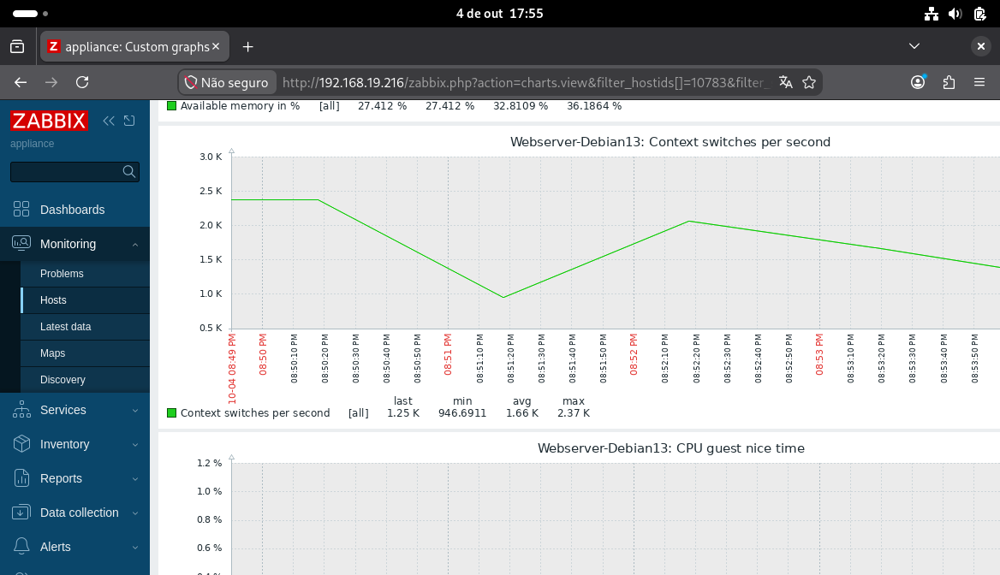

# Laboratório de Cibersegurança - Blue Team 

Estou montando meu primeiro projeto de Cibersegurnça. Comecei com um **Debian 13** e estou fazendo ele se comunicar com o **Zabbix** para conseguir monitorar a máquina. 

Depois, quero utilizar esse ambiente para estudar coisas de **Blue Team**, como:
- Análise de logs
- Mapeamento de portas e serviços 
- Criação de alertas 
- Identificação de atividades suspeitas

Vou construindo e documentando tudo aos poucos. O progresso completo ficará disponível no repositório, servindo como parte do meu portfólio.

markdown

---

## Monitoramento da Máquina Ubuntu

Consegui configurar com sucesso o Zabbix para monitorar a máquina Ubuntu! O gráfico abaixo mostra que a comunicação está funcionando e que os dados estão sendo coletados:

