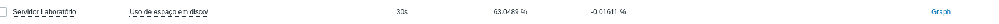
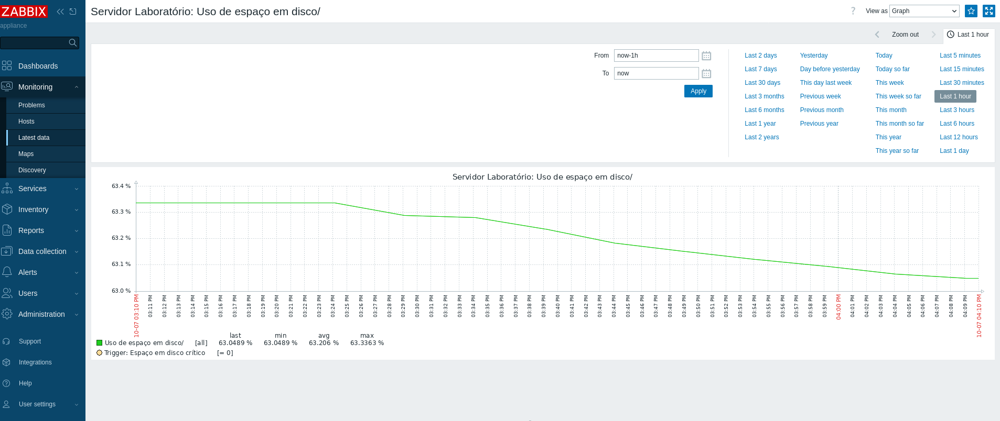

# Laboratório de Cibersegurança — Blue Team

Estou montando meu primeiro projeto de Cibersegurança. Comecei com um **Debian 13** e estou fazendo ele se comunicar com o **Zabbix** para conseguir monitorar a máquina.

Depois quero usar esse ambiente para estudar coisas de **Blue Team**, como:

- Análise de logs
- Mapeamento de portas e serviços
- Criação de alertas
- Identificação de atividades suspeitas

Vou construindo e documentando tudo aos poucos. O progresso completo vai ficar no repositório para servir como meu portfólio.

---

## 📊 Monitoramento da Máquina Ubuntu

Consegui com sucesso configurar o Zabbix para monitorar a máquina! A captura abaixo mostra que a comunicação está funcionando e os dados estão sendo coletados:


---

## 🚨 Monitoramento de Tentativas de Login SSH

Implementei um alerta que detecta automaticamente falhas de acesso ao servidor via SSH.

- ✅ Leitura direta dos logs do sistema
- ✅ Alerta disparado em tempo real pelo Zabbix
- ✅ Visualização imediata na tela de problemas

### Dados coletados:


### Alerta acionado:


----

## 🔍 Varredura de Portas — Nmap

Resultado da varredura de portas e serviços na máquina local:

```bash
nmap -sV localhost


## 🔥 Firewall — nftables

No Debian 13, o `iptables` foi substituído pelo `nftables`. Configurei para permitir apenas o necessário:

| Porta | Serviço | Ação |
|---|---|---|
| 22/tcp | SSH | ✅ Permitir |
| 80/tcp | HTTP (Zabbix Web) | ✅ Permitir |
| 10050/tcp | Agente Zabbix | ✅ Permitir |
| Interface local (lo) | — | ✅ Permitir |
| Todas as outras | — | 🔒 Bloquear |

### Comandos usados:
```bash
sudo apt install nftables -y
sudo systemctl enable --now nftables
sudo nft flush ruleset
sudo nft add table inet filter
sudo nft add chain inet filter input { type filter hook input priority 0 \; policy drop \; }
sudo nft add chain inet filter output { type filter hook output priority 0 \; policy accept \; }
sudo nft add chain inet filter forward { type filter hook forward priority 0 \; policy drop \; }
sudo nft add rule inet filter input ct state established,related accept
sudo nft add rule inet filter input tcp dport 22 accept
sudo nft add rule inet filter input tcp dport 80 accept
sudo nft add rule inet filter input tcp dport 10050 accept
sudo nft add rule inet filter input iif lo accept


## 🧪 Teste de Detecção — Outro Dispositivo na Rede

### Cenário:
Testei o monitoramento fazendo tentativas de acesso **de outro computador** (Windows) para verificar se o sistema detecta origens diferentes.

- **Origem:** Computador Windows — `192.168.19.56`
- **Alvo:** Servidor Debian
- **Credenciais:** inválidas (usuário inexistente/senha errada)
- **Tentativas:** 3 em menos de 15 segundos

### Evidência capturada:

out 06 17:00:07 webserver sshd-session[14529]: Failed password for invalid user senhaerrada from 192.168.19.56 port 26833 ssh2
out 06 17:00:12 webserver sshd-session[14529]: Failed password for invalid user senhaerrada from 192.168.19.56 port 26833 ssh2
out 06 17:00:18 webserver sshd-session[14529]: Failed password for invalid user senhaerrada from 192.168.19.56 port 26833 ssh2


### ✅ Conclusão:
O sistema detecta tentativas de acesso vindas de **qualquer dispositivo** na rede — não apenas de dentro do servidor. A origem é identificada com IP, porta e horário exatos.


---


---

## 💾 Monitoramento de Espaço em Disco

- **Item:** `vfs.fs.size[/,pfree]` — Porcentagem de espaço livre
- **Valor atual:** ~63% livre ✅
- **Alerta:** Menos de 10% livre → avisa ⚠️

### Dados em tempo real:


### Gráfico de uso:


### Expressão do alerta:

last("Servidor Laboratório/vfs.fs.size[/,pfree]") < 10


**Status:** ✅ Monitorando normalmente


---

## 📚 Comandos Essenciais — Guia de Estudo

Aqui estão os comandos mais usados durante o laboratório, organizados para consulta rápida.

### 📂 Navegação e Arquivos
```bash
pwd                  # Mostra onde estou
ls                   # Lista arquivos
ls -la               # Lista tudo (inclusive ocultos)
cd nome-pasta        # Entra na pasta
cd ..                # Volta uma pasta
mkdir nome-pasta     # Cria pasta nova
cp origem destino    # Copia arquivo
mv origem destino    # Renomeia/move
rm nome-arquivo      # Apaga arquivo
cat nome-arquivo     # Mostra conteúdo


✏️ Edição de Arquivos (Nano)


nano nome-arquivo    # Abre para editar
# Ctrl + O → Salvar
# Ctrl + X → Sair
# Ctrl + K → Apagar linha

🔄 Serviços do Sistema

ip a                 # Mostra endereço IP
df -h                # Espaço em disco
free -h              # Memória RAM
uptime               # Tempo ligado / carga
top                  # Processos rodando → q para sair


🔍 Filtros e Busca

comando | grep "palavra"   # Filtra linhas com a palavra
comando | wc -l            # Conta linhas
journalctl -u ssh --since "10m ago"  # Logs dos últimos 10 min

🔒 Rede e Segurança

ping 192.168.X.X         # Testa conexão
nmap -sV localhost       # Varrer portas locais
ss -tulpn                # Ver portas abertas
sudo nft list ruleset    # Ver firewall

